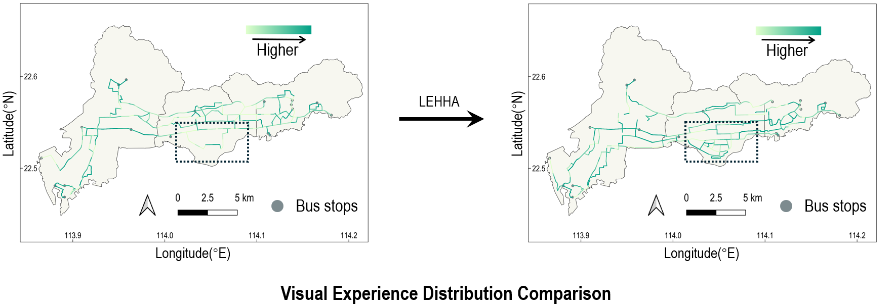

<h4 align="center">Automated Visual Experience Assessment & Network Optimization with assist of LLM</h4>

<p align="center">
  
</p>

This is the official repository for the paper "From efficiency to experience: Integrating automated visual quality assessment into urban bus network design". The work presents a data‑driven framework that incorporates automated street‑level visual quality assessment for urban transit network design via the Large Language Model‑Enhanced Hybrid Heuristic Algorithm (LEHHA).

## Highlights

* Shifting transit planning from pure efficiency to a visual experience paradigm
* Bi-objective optimization model balancing travel demand and visual experience
* Developing an LLM-Enhanced algorithm for automated operator discovery
* Improving visual quality by 72.0% without compromising transit demand coverage
* Providing a novel framework to design scenic transit and enhance urban well-being

## Running the Project

### 1. Install prerequisites

Use `environment.yml` to create a conda environment for the project:

```sh
conda env create -f environment.yml
conda activate visual-transit
```

### 2. Data Preparation (with zensvi)

Download and organize the required datasets using zensvi:

**Street View Imagery (SVI)**: Collect street view images for your study area using zensvi with Baidu Maps API or Google Street View API.

**Road Network**: Extract road network topology from OpenStreetMap (OSM) using zensvi built-in tools.

**Travel Demand**: Prepare OD (origin-destination) demand matrix for your study area.

**Demo script**:
```python
# Example: Collecting street view images with zensvi
import zensvi

# Initialize zensvi with your API credentials
zen = zensvi.Zensvi(api_key="your_api_key")

# Collect street view images for your study area
zen.collect_streetview(
    bbox=[min_lon, min_lat, max_lon, max_lat],  # bounding box
    output_dir="data/street_view/",
    source="baidu"  # or "google"
)
```

### 3. Visual Experience Assessment (with zensvi)

Run the dual-layer deep learning framework to extract visual indicators using zensvi:

```sh
# Example: Using zensvi for visual quality assessment
python -c "
import zensvi

# Initialize zensvi visual quality assessment
vqa = zensvi.VisualQualityAssessment(model_path='models/')

# Process street view images and extract visual indicators
results = vqa.assess(
    input_dir='data/street_view/',
    output_dir='data/visual_indicators/',
    indicators=['greenery', 'skyline', 'enclosure', 'complexity', 'safety']
)

print('Visual assessment completed!')
"
```

**Demo script**:
```python
# Example: Visual quality assessment with zensvi
import zensvi
import pandas as pd

# Initialize the visual quality assessor
vqa = zensvi.VisualQualityAssessment()

# Load street view images
images = vqa.load_images('data/street_view/*.jpg')

# Extract visual indicators for each image
indicators = []
for img in images:
    result = vqa.extract_indicators(img)
    indicators.append({
        'image_id': img.id,
        'greenery': result.greenery_score,
        'sky_openness': result.sky_score,
        'visual_complexity': result.complexity_score,
        'safety_perception': result.safety_score
    })

# Save results to CSV
df = pd.DataFrame(indicators)
df.to_csv('data/visual_indicators/assessment_results.csv', index=False)
```

### 4. Network Optimization

Run the LEHHA optimization algorithm:

```sh
python agent.py
python main.py
```

- The first step initiates the operator discovery process and prepares for the second step.
- The second step optimizes the transit network.

## Project Structure

```
LEHHA/
├── data/                   # Input datasets for optimization
├── src/                    # Source code
│   ├── Prompt/             # LLM prompt templates for operator discovery
│   ├── main.py             # Main entry point for the whole pipeline
│   ├── ga_engine.py        # Bi‑objective optimization engine
│   ├── agent.py            # Operator discovery phase
│   ├── config.py           # Hyper‑parameter and experiment configuration
│   ├── function.py         # Core objective & evaluation functions
│   └── utils.py            # Helper and utility functions
└── environment.yml         # Conda environment configuration file
```

## Experimental Results

### Study Area
- **Location**: Shenzhen, China (Nanshan, Futian, and Luohu districts)
- **Dataset Size**: 320,000 street view images, 621 nodes, 911 edges
- **Total Network Length**: 520.17 km

### Performance Comparison

| Algorithm | Hypervolume | Best Z1 | Best Z2 | Time (s) |
|-----------|-------------|---------|---------|----------|
| **LEHHA** | **0.2668** ± 0.0077 | **0.3885** ± 0.0066 | **0.6937** ± 0.0154 | 729.24 ± 28.07 |
| NSGA-II | 0.1796 ± 0.0090 | 0.3321 ± 0.0049 | 0.5416 ± 0.0206 | 560.05 ± 18.30 |
| MOEA/D | 0.1731 ± 0.0076 | 0.3181 ± 0.0041 | 0.5453 ± 0.0201 | 978.83 ± 105.65 |
| MOPSO | 0.1517 ± 0.0099 | 0.3287 ± 0.0121 | 0.4622 ± 0.0134 | 658.57 ± 72.38 |

## Acknowledgements

This research was supported by:
- National Natural Science Foundation of China (No.42471493, No.42401553)
- Natural Science Foundation of Top Talent of SZTU (No.GDRC202415)

We gratefully acknowledge the members of the NUS Urban Analytics Lab for the discussions.

This project is made possible by using the following packages and resources:

* [PyTorch](https://pytorch.org/) - Deep learning framework
* [DeepLabV3+](https://github.com/tensorflow/models/tree/master/research/deeplab) - Semantic segmentation
* [Place Pulse 2.0](https://www.media.mit.edu/projects/place-pulse/2.0/) - Perceptual dataset
* [OpenStreetMap](https://www.openstreetmap.org/) - Road network data
* [Baidu Maps API](https://lbsyun.baidu.com/) - Street view imagery
* [NSGA-II](https://www.iitk.ac.in/kangal/Deb_NSGA-II.htm) - Multi-objective optimization baseline

## License

Distributed under the MIT License. See `LICENSE` for more information.
